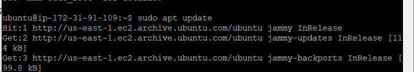
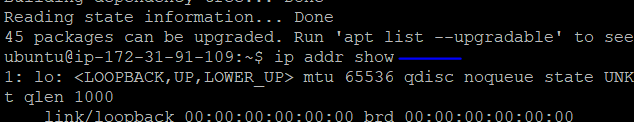

# CLIENT-SERVER ARCHITECTURE WITH MYSQL

## Client-Server refers to an architecture in which two or more computers are connected together over a network to send and receive requests between one another.
## In their communication, each machine has its own role: the machine sending requests is usually referred as "Client" and the machine responding (serving) is called "Server".
### A simple diagram of Web Client-Server architecture is presented below: In this instance, a machine that is trying to access a Web site using Web browser or simply ‘curl’ command is a client and it sends HTTP requests to a Web server (Apache, Nginx, IIS or any other) over the Internet.

### If extended this concept further and add a Database Server to our architecture, we can get this picture below. In this case, our Web Server has a role of a "Client" that connects and reads/writes to/from a Database (DB) Server (MySQL, MongoDB, Oracle, SQL Server or any other), and the communication between them happens over a Local Network (it can also be Internet connection, but it is a common practice to place Web Server and DB Server close to each other in local network).

### The setup on the diagram above is a typical generic Web Stack architecture  (LAMP, LEMP, MEAN, MERN), this architecture can be implemented with many other technologies – various Web and DB servers, from small Single-page applications SPA to large and complex portals.

### Depoloy 2 new EC2 Instance of t2.nano family with Ubuntu Server 20.04 LTS (HVM) image. One as server while the other as client.

*On the server machine, update ubuntu with below command:*

`sudo apt update`

*On the server machine, install mysql server with below command:*

`sudo apt install mysql-server -y`

*Enable mysql server with below command:*

`sudo systemctl enable mysql`

*On the client machine, update ubuntu with below command:*

`sudo apt update`

*Install mysql client using the command:*

`sudo ap install mysql-client -y`

*Use below command to retrieve the ip address of the machine (both server and client if needed):*

`ip addr show`

#### By default, both EC2 virtual servers are located in the same local virtual network, so they can communicate to each other using local IP addresses. Use mysql server's local IP address to connect from mysql client. MySQL server uses TCP port 3306 by default, so you will have to open it by creating a new entry in ‘Inbound rules’ in ‘mysql server’ Security Groups. For extra security, do not allow all IP addresses to reach your ‘mysql server’ – allow access only to the specific local IP address of your ‘mysql client’.

*Edit inbound rule to allow desired traffic as show below*

*Secure installation by running the security script below on the mysql server:*

`sudo mysql_secure_installation`

*Create remote user to access server via any IP address (%) with the command (on server):

`CREATE USER 'remote_user'@'%' IDENTIFIED WITH mysql_native_password BY 'password';`

*Create a database (on the server):*

`CREATE DATABASE test_db;`

*On the server grant privileges to the remote user to the created database:*

`GRANT ALL ON test_db.* TO 'remote_user'@'%' WITH GRANT OPTION;`

*Flushing the privilages with below command on the server and exit mysql server:*

`FLUSH PRIVILEGES;`

`exit`

*Using a prefered editor access mysqld.cnf and configure MySQL server to allow connections from remote hosts. Replace ‘127.0.0.1’ to ‘0.0.0.0’ (0.0.0.0 will allow all IP, for security in production environment, specify IP) like this: Then save*

`sudo vi /etc/mysql/mysql.conf.d/mysqld.cnf`

*Restart mysql server using the below command:*

`sudo systemctl restart mysql`

*On the mysql client machine, access the mysql server using the below command:*

`sudo mysql -u remote_user -h <mysql_server_ip_address> -p`

*Verify access to the server from client. If an output like screen shot below then we have fully functional MySQL Client-Server set up:*

`show databases;`

